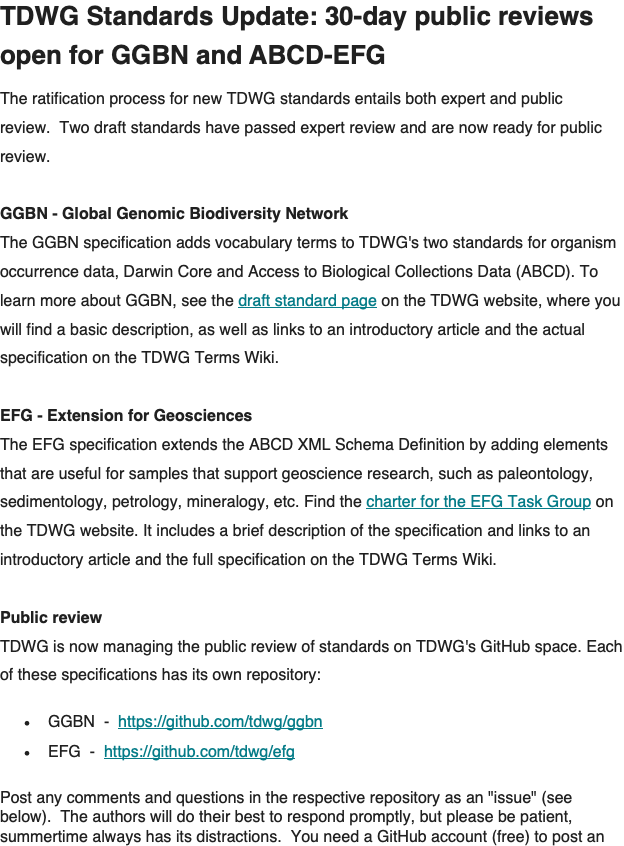

# TDWG Standards Update: 30-day public reviews open for GGBN and ABCD-EFG

Review manager and Task Group identities not disclosed.

(from the [emailed newsletter](https://mailchi.mp/e4d3a358b3af/tdwg-standards-update-30-day-public-reviews-open-for-two-draft-standards-ggbn-and-abcd-efg?e=5917438abb))

```
From: TDWG Secretariat secretariat@tdwg.org
Reply-To: TDWG Secretariat secretariat@tdwg.org
Date: Wednesday, July 1, 2020 at 9:33 PM
To: Steve Baskauf steve.baskauf@Vanderbilt.Edu
Subject: TDWG Standards Update: 30-day public reviews open for two draft standards, GGBN and ABCD-EFG
```



